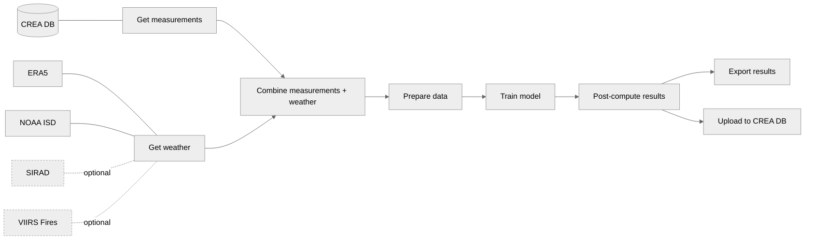

# creadeweather

## Overview

`creadeweather` is an R package designed to control for the impact of weather on air pollution levels. The package uses machine learning techniques to isolate and remove the effects of weather variables on air pollutant concentration, providing a clearer understanding of the role of emission changes.

See an example application [here](https://energyandcleanair.org/weather-correction-of-air-pollution-application-to-covid-19/) in the context of COVID-19 lockdowns.


## Diagram



## Installation

You can install the development version of `creadeweather` from GitHub:

```R
# Install remotes if not already installed
install.packages("remotes")

# Install creadeweather from GitHub
remotes::install_github("energyandcleanair/creadeweather")
```

## Requirements

Ensure you have the following variables set up in your `.Renviron` file:

```
CREA_DB_URL=
CREA_MONGODB_URL=
DIR_ERA5=
```

## Usage

Here is a basic example of how to use `creadeweather`:

```R
library(creadeweather)

# Define the location, data source, and pollutant
location_id <- rcrea::cities(name="delhi")$id
source <- "cpcb"
poll <- rcrea::NO2

# Perform weather adjustment
results <- creadeweather::deweather(
  poll=poll,
  source=source,
  location_id=location_id,
  output=c("anomaly","trend"),
  upload_results=FALSE
)
```


## License

This project is licensed under the MIT License. See the [LICENSE](LICENSE) file for details.

## Author(s)
Developed by the Centre for Research on Energy and Clean Air (CREA).

Main author: [Hubert Thieriot](mailto:hubert@energyandcleanair.org)

Contributors: [Danny Hartono](mailto:danny@energyandcleanair.org)


## See Also

For more on weather adjustment in air quality data, check out [`rmweather`](https://github.com/skgrange/rmweather).
