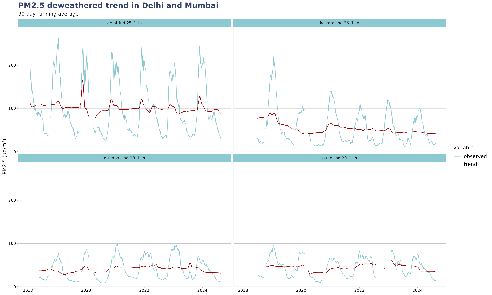
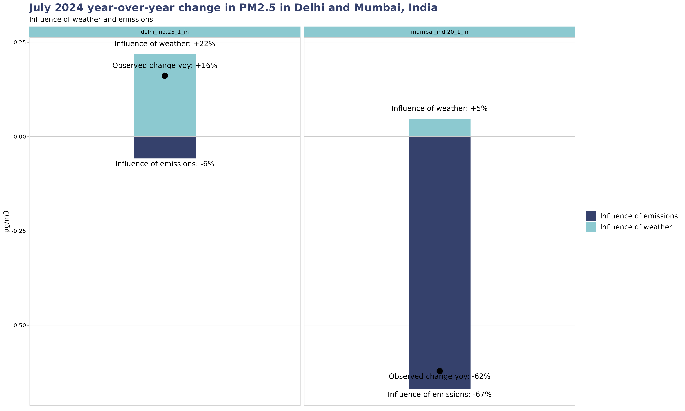

# "Deweathering" air quality measuremnets

## Introduction

Air pollution is influenced by both natural factors, such as weather, and human activities, particularly emissions. Understanding the distinct contributions of these factors is crucial for developing effective air quality management strategies and measuring progress. This document outlines CREA's method to disentangle the effects of weather from emissions on air pollution levels using a machine learning model.

## What is deweathering?
Deweathering refers to the process of correcting for the influence of weather on air pollution data to better understand the underlying trends in air quality. This method separates the effects of natural weather patterns from other factors affecting air pollution levels, such as changes in emissions. By doing so, deweathering provides clearer insights into the structural and long-term changes in air quality, independent of short-term weather fluctuations.

## Methodology: Deweathering Air Pollution Data

Deweathering is achieved by training a machine learning morel (in our case a Gradient Boosting Machine) to predict air pollution levels based on weather-related variables. This model can be used in two ways, depending on the desired application.

- **Trend analysis**: a trend term (i.e. the date) is added as a predictor in the model. The trained model is then rerun with a sample of weather conditions for each date individually. The daily average of the resulting predictions are then identified with the "weather-corrected" trend.

- **Residual analysis**: The residuals from this model, representing the difference between the predicted and actual pollution levels, are interpreted as the component of air pollution that cannot be explained by weather conditions. This difference is assumed to be primarily driven by change in emissions.

### 1. Data Inputs

**Weather Variables:**  
The model incorporates a comprehensive set of weather variables sourced from the ERA5 reanalysis dataset, including:

- Air temperature - minimum and maximum
- Atmospheric pressure
- Wind direction
- Wind speed
- Precipitation
- Dewpoint temperature
- Planetary boundary layer - minimum and maximum

**Data Aggregation:**  
Both air pollution measurements and weather variables are aggregated at daily frequencies.

**Lagged Variables:**  
To capture delayed effects of weather, the model includes lagged versions of these variables for 1, 2, and 3 days prior to the day of interest.

### 2. Machine Learning Model: Gradient Boosting Machine (GBM)

The GBM is trained using historical data on air pollution levels and weather variables. It "predicts" pollution levels based solely on weather conditions (unless a trend variable is used). The model includes several regularization techniques, such as shrinkage (learning rate), subsampling, and cross-validation (cv_folds=3) to prevent overfitting and ensure generalization.

## Applications

### 1. Trend Analysis

Trend analysis of deweathered data allows for the identification of long-term changes in air pollution that are driven by emissions rather than weather variability. It is accomplished by introducing a general trend term (i.e. date) as a predictor and extracting the partial depence of the trained model on this variable. The figure below shows the example of such trend for Delhi, India.

### 2. Monthly Year-over-Year (Y-o-Y) Analysis of Weather vs. Emissions

This application relies on residual analysis: the model is trained on a dataset that excludes the months of interest i.e. the month we are interested in and the same month the prior year. The model is then used to "predict" the air quality for the two months. The change in predicted levels between the two months is attributed to weather conditions, as they were predicted using weather conditions alone. The difference with the observed change in air quality is attributed is attributed to change in emissions.

Below is the observed, predicted and residual (i.e. observed - predicted), also called *anomaly* PM2.5 over time in Delhi, India. The orange areas represents the dates that were explicitely excluded from the training dataset (on top of the fraction dedicated to model validation and testing).

The respective influence of weather and emissions in the year-on-year changes of air quality are shown in the chart below.

From this chart, one can conclude that:
- Delhi's observed increase of PM2.5 levels (+16%) were due to weather conditions. After correcting for these, we would expect an actual decrease of 10%.
- Mumbai's observed decrease of PM2.5 levels (-62%) was almost entirely due to change in emissions.

## References
Grange, S. K., & Carslaw, D. C. (2019). Using meteorological normalisation to detect interventions in air quality time series. Science of the Total Environment, 653, 578–588. https://doi.org/10.1016/j.scitotenv.2018.10.344